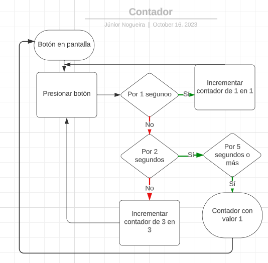

Contador en JavaScript Vanilla

Código y comentarios en español.

El código se podía mejorar, implementando ReactJS para manejar mejor los estados.

La temática estaba en apretar un botón por 1 segundo o menos y que el contador se incrementara de 1 en 1 hasta llegar a 15, luego se regresa al valor 1.

Luego, si se mantiene el botón presionado por 2 segundos, el contador pasa a incrementarse de 3 en 3 hasta llegar a 15, cuando se regresa al valor 1.

Por fin, al mantener el botón presionado por 5 segundos o más, el contador se detiene y asume el valor 1 directamente.

Diagrama de flujo

Diagrama de Despliegue

+-----------------------+ +----------------------+
| Navegador Web | | Máquina Local |
| | | |
| +----------------+ | | +--------------+ |
| | Interfaz de | |Evento | | Script | |
| | Usuario |---------------->| del | |
| | | |Evento | | Comunicación | |
| | +--------+ |<----------------| | |
| | | Botón | | | | +--------------+ |
| | | Web | | | | |
| | +--------+ | | | |
| +----------------+ | +----------------------+
+-----------------------+

Diagrama de Estados

+--------------------------------------------------+
| |
| +-------------------+ |
| | | |
| | Botón Presionado | |
| | | |
| +-------------------+ |
| | | |
| | | |
| | | |
| | | |
| | | |
| +-----v-----+ +--v--+ |
| |Incremento 1| |Hold| |
| |1 unidad | |2s+ | |
| | | | | |
| +-----------+ +----+ |
| | |
| | |
| | |
| | |
| | |
| +-----v-----+ |
| |Incremento 3| |
| |3 unidades | |
| | | |
| +-----------+ |
| |
| |
| |
| +----------------+ |
| |Valor Fijo en 1 | |
| | | |
| +----------------+ |
| |
+--------------------------------------------+
